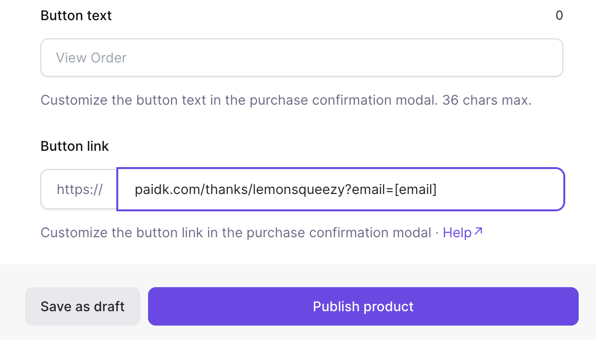
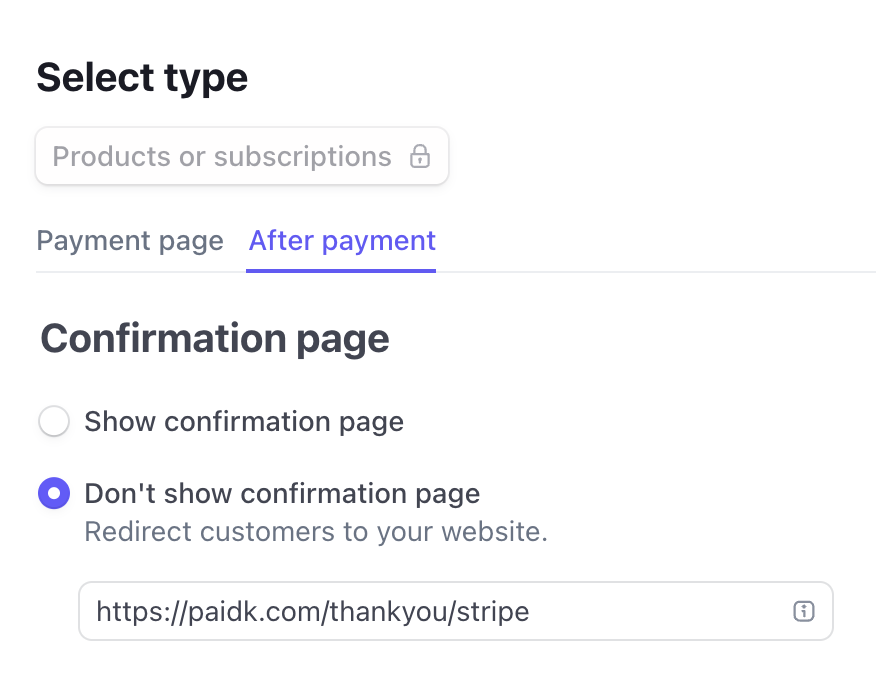

# Change email provider

```
befast init nextjs-example
```

```
# Development
npm run dev

# Production
befast deploy
```

## Confirmation Page

- lemonsqueezy
  https://docs.lemonsqueezy.com/help/products/button-link-variables
  

- stripe
  https://buy.stripe.com/test_6oE5kD88g2Sk2Vq5kk?prefilled_email=a%40a.com
  
